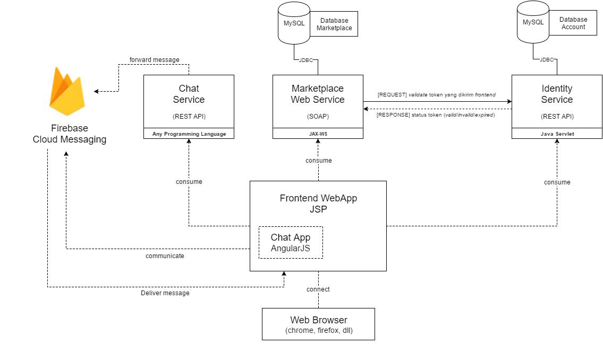
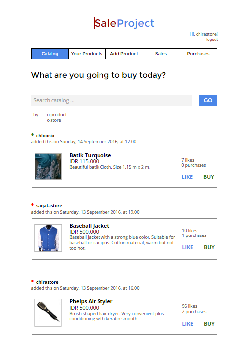
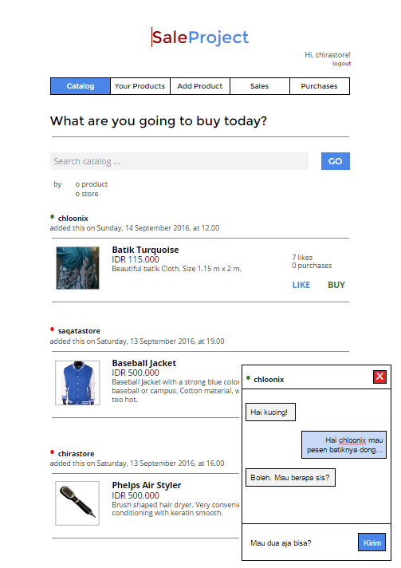

# Tugas 3 IF3110 Pengembangan Aplikasi Berbasis Web

Melakukan upgrade Website Marketplace sederhana pada Tugas 2 dengan mengaplikasikan ***cloud service* (Firebase Cloud Messaging) dan *framework* AngularJS**.

**Luangkan waktu untuk membaca spek ini sampai selesai. Kerjakan hal yang perlu saja.**

## Tujuan Pembuatan Tugas

Diharapkan dengan tugas ini Anda dapat mengerti:
* Salah satu Frontend framework yaitu AngularJS dan kegunaannya.
* *Cloud service* Firebase Cloud Messaging (FCM) dan kegunaannya.
* Web security terkait access token dan HTTP Headers.

## Anggota Tim

Setiap kelompok beranggotakan **3 - 4 orang**. Daftar anggota kelompok terdapat pada link berikut: https://drive.google.com/open?id=1wpzU2VHZXvSVNR6TS4sxILVvHimQYhxQhorMr1nSelw

## Petunjuk Pengerjaan
1. Buatlah organisasi pada gitlab dengan nama sesuai dengan nama tim yang anda daftarkan.
2. Tambahkan anggota tim pada organisasi anda.
3. Fork pada repository ini dengan organisasi yang telah dibuat.
4. Ubah hak akses repository hasil Fork anda menjadi **private**.
5. Silakan commit pada repository anda (hasil fork). Lakukan berberapa commit dengan pesan yang bermakna, contoh: `fix css`, `create post done`, jangan seperti `final`, `benerin dikit`. Disarankan untuk tidak melakukan commit dengan perubahan yang besar karena akan mempengaruhi penilaian (contoh: hanya melakukan satu commit kemudian dikumpulkan). Sebaiknya commit dilakukan setiap ada penambahan fitur. **Commit dari setiap anggota tim akan mempengaruhi penilaian individu.** Jadi, setiap anggota tim harus melakukan commit yang berpengaruh terhadap proses pembuatan aplikasi.
6. Edit file readme ini semenarik mungkin (gunakan panduan Markdown language), diperbolehkan untuk merubah struktur dari readme ini. (Soal tidak perlu dipertahankan).
7. Pada Readme terdapat tampilan aplikasi dan penjelasan mengenai pembagian tugas masing-masing anggota (lihat formatnya pada bagian **pembagian tugas**).
8. Merge request dari repository anda ke repository ini dengan format **Nama kelompok** - **NIM terkecil** - **Nama Lengkap dengan NIM terkecil** sebelum **Rabu, 30 November 2016 18.00**.

### Arsitektur Umum
Tugas 3 ini terdiri dari komponen tugas 2 dan tambahan yang harus dibuat:
* `Chat REST Service`: digunakan untuk menerima HTTP request dari client terkait fungsionalitas pengiriman pesan dengan menggunakan layanan Firebase Cloud Messaging (FCM).
* `Komponen front end chat`: digunakan untuk melakukan request ke Chat Service dengan menggunakan AJAX dan menampilkan chat.

### Deskripsi Tugas
Kali ini, anda diminta untuk menambah fungsionalitas chat pada aplikasi yang telah anda buat pada tugas 2. Aplikasi ini akan menggunakan AngularJS (bukan Angular 2) sebagai framework front-end, serta menggunakan layanan cloud Firebase Cloud Messaging sebagai media penyampaian pesan. Selain itu, Anda juga diminta untuk mengimplementasikan beberapa fitur security. spesifikasi untuk tugas ini adalah sebagai berikut:

1. Pengguna dapat saling bertukar pesan dengan pengguna lain secara realtime di halaman katalog. Fitur ini harus diimplementasikan dengan AngularJS.
2. REST service yang akan menghubungkan client dan Firebase Cloud Messaging. Rincian service ini akan dijelaskan kemudian. Silahkan pelajari cara mendaftar ke layanan Firebase, dan cara membuat project baru.
2. Pengguna harus login terlebih dahulu sebelum dapat melakukan chat. Silahkan cari cara untuk sharing session antara JSP dan AngularJS. Sebagai contoh, anda dapat menggunakan cookie yang dapat diakses oleh keduanya.
3. Aplikasi dapat menampilkan pengguna yang sedang online. Pengguna yang sedang online ditandai dengan tanda di samping nama pengguna pada halaman katalog. Ketika nama pengguna yang sedang online diklik, maka akan muncul kotak chat antar pengguna.
4. Pengguna dengan IP address yang berbeda tidak dapat menggunakan access token yang sama.
5. Pengguna dengan user-agent yang berbeda tidak dapat menggunakan access token yang sama. Dalam hal ini, user-agent yang dimaksud adalah web browser yang digunakan.
6. Komponen yang harus digunakan pada AngularJS adalah:
	* Data binding (ng-model directives)
	* Controllers (ng-controllers)
	* ng-repeat, untuk menampilkan list
	* $http untuk AJAX request
	* $scope untuk komunikasi data antara controller dengan view.
	* ng-show dan ng-hide untuk menampilkan/menyembunyikan elemen
7. tidak perlu memperhatikan aspek keamanan dan etika dalam penyimpanan data.

### Rincian Arsitektur Aplikasi Chat

Proses untuk komunikasi antar client adalah sebagai berikut:
1. Ketika client dijalankan, client akan meminta token (token yang berbeda dengan token untuk authentication dari Identity Service) dari FCM.
2. FCM mengirimkan token ke client.
3. Setelah token diterima, client akan mengirim token serta identitas dari client (nama/email) ke chat server. Identitas client digunakan untuk mengidentifikasi kepemilikan token.
4. Untuk mengirim pesan kepada client lain, client pertama mengirimkan pesan yang berisi identitas pengirim, identitas tujuan, dan isi pesan ke chat server.
5. Chat server kemudian akan mencari token yang terkait dengan identitas tujuan.
6. Chat server lalu mengirim request ke FCM untuk mengirimkan pesan kepada client dangan token yang terkait.
7. FCM mengirimkan pesan kepada tujuan.

### Asumsi yang Digunakan
1. Pada tugas ini, diasumsikan kedua client sedang aktif. Aplikasi hanya akan dijalankan pada localhost, sehingga memerlukan 2 browser yang berbeda untuk mensimulasikan client yang berbeda. Aplikasi berjalan pada localhost karena browser mensyaratkan sumber aplikasi harus aman untuk operasi-operasi yang digunakan pada aplikasi ini. Localhost termasuk lokasi yang diperbolehkan oleh browser.
2. Kedua browser tersebut harus dalam keadaan aktif dan terfokus, serta tidak terminimize. Hal ini karena cara kerja service worker, yang hanya dapat memberikan notifikasi, dan tidak dapat melakukan manipulasi halaman apabila web browser tidak sedang terfokus ketika pesan datang.
Selain itu, seorang pengguna hanya dapat chatting dengan 1 pengguna lain dalam 1 waktu, sehingga hanya 1 kotak chat yang ditampilkan.

### Skenario Chatting
Skenario penggunaan aplikasi adalah sebagai berikut.
Misal pengguna yang memulai chat adalah A, dan yang menerima chat adalah B.
1. A dan B login untuk masuk ke aplikasi.
2. A dan B membuka halaman katalog. Pada tahap ini, status online dari kedua pihak sudah tercatat pada chat server.
3. A membuka kotak chat dengan cara melakukan klik pada nama B di halaman katalog.
4. Kotak chat akan muncul pada layar A.
5. A mengetikkan pesan, dan menekan tombol kirim.
6. Pesan dikirim ke B melalui chat server dan FCM.
7. ketika pesan sudah diterima di B, kotak chat pada layar B akan muncul.
8. B dapat membalas chat dari A.
9. Apabila A ingin menyudahi percakapan, A dapat menekan tombol untuk menutup kotak. Begitu pula dengan B.
10. Apabila A ingin melakukan chat dengan pihak lain, katakanlah C, C harus login dan browsernya harus terfokus.

### Skenario Umum Program
Skenario program selain chat, pada umumnya sama seperti tugas 2. Akan tetapi, metode pengecekan token pada identity service sedikit berbeda.

Identity Service harus mengecek: 
1. Apakah access token ini sudah kadaluarsa?
2. Apakah access token ini digunakan pada browser yang berbeda?
3. Apakah access token ini digunakan dengan koneksi internet yang berbeda?

Jika jawaban salah satu pertanyaan tersebut adalah "ya", maka identity service akan memberikan respon error dan detail errornya.

### Mekanisme pembuatan token
Token anda harus mempunyai informasi terkait browser (user agent) dan IP address dari pengguna. Identity service harus dapat mengekstrak informasi tersebut. Sebagai contoh, anda dapat melakukan (tidak harus) konstruksi token dengan `format:some_random_string#user_agent#ip_address`. Jika pada tugas 2 token anda adalah abcdefgh Maka pada tugas 3 token anda adalah `abcdefgh#Mozilla/5.0 (Windows NT 6.3; WOW64) AppleWebKit/537.36 (KHTML, like Gecko) Chrome/46.0.2490.86 Safari/537.36#167.205.22.104`.

Token tidak perlu dienkripsi-dekripsi (for simplicity)

### Tampilan Program
Halaman Catalog

Chatting

### Referensi Terkait
Berikut adalah referensi yang dapat Anda baca terkait tugas ini:
1. https://firebase.google.com/docs/web/setup
2. https://firebase.google.com/docs/cloud-messaging/js/client
3. https://docs.angularjs.org/api

Selain itu, silahkan cari "user agent parser", "how to get my IP from HTTPServletRequest", dan "HTTP Headers field" untuk penjelasan lebih lanjut.

### Chat AngularJS

Chat box dibuat dengan menggunakan angularJS. Terdapat sebuah directive AngularJS yang mengatur chatbox. Pesan disimpan dalam bentuk stack. 
1. Pengguna mengklik nama penjual yang sedang online 
2. Kotak chat muncul (ng-show). 
3. Pengguna mengirim pesan ke penjual. Pesan ditambahkan ke chat dan diteruskan ke chat service. 
4. Chat service meneruskan pesan ke Firebase. 
5. Firebase mengirimkan pesan ke tujuan (user/penjual). 
6. Semua pesan yang sudah dikirim/diterima ditampilkan dengan ng-repeat. Front-end chat dibuat dengan beberapa framework seperti AngularJS, Bootstrap, JQuery.

### Pembagian Tugas

Tugas kali ini cukup rumit, karena melibatkan layanan dari pihak ketiga, dan framework. Bila tak mengerti, luangkan waktu belajar lebih banyak. Bila belum juga mengerti, belajarlah bersama-sama kelompokmu. Bila Anda sekelompok bingung, bertanyalah (bukan menyontek) ke teman seangkatanmu. Bila seangkatan bingung, bertanyalah pada asisten manapun.

Harap semua anggota kelompok mengerjakan baik implementasi Firebase sebagai *cloud service* maupun *framework* AngularJS. Tuliskan pembagian tugas seperti berikut ini.

Chat app frontend :
1. Fungsionalitas A : 135140XX  
2. Fungsionalitas B : 135140XX  

Chat app backend :  
1. Fungsionalitas C : 135140XX  
2. Fungsionalitas D : 135140XX  
    
Fitur security (IP, User-agent) :
1. Fungsionalitas E : 135140XX
2. Fungsionalitas F : 135140XX

## About

Asisten IF3110 2016

Adin | Chairuni | David | Natan | Nilta | Tifani | Wawan | William

Dosen: Yudistira Dwi Wardhana | Riza Satria Perdana
"# Firebase AngularJS" 
